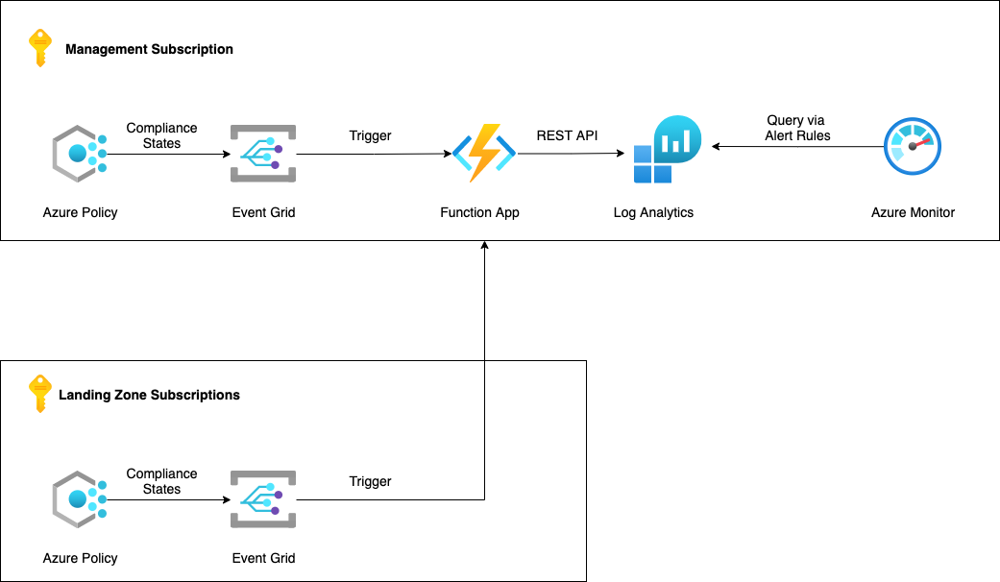

# Overview

This bicep code is developed to automate deployment of a Azure Non-Compliance resource monitoring solution.

## Resources details

The list of resources created by this Bicep Project are as follows : -

- Log Analytics Workspace
- Event Grid Topic and Subscription
- Function App (Triggered Manually using AZ CLI or from VSCode)
- Azure Monitor Alert Rule
- Storage Account
- Azure Monitor Metrics
- Key Vault

## Diagram

Here's a rough diagram of the resources it creates

## Operations details

The Bicep project is configured to work on the following principle

- The **main.bicep** creates the Resource Group, Log Analytics Workspace and the Function App, whereas the **main.eventgrid.bicep** creates the Event Grid Topic and Subscription.
- The parameters file named **main.parameters.json** and ** main.eventgrid.parameters.json** feeds the modules with defined values.

### Install Azure CLI

You can install Azure CLI from [here](https://docs.microsoft.com/en-us/cli/azure/install-azure-cli)

### Authenticate Azure CLI

Hit the command **az login** from Comamnd Prompt or Terminal depending upon your OS. More details can be found [here](https://docs.microsoft.com/en-us/cli/azure/get-started-with-azure-cli)

### Trigger Manually

Fire the below command to create the resources using Bicep script

> az deployment sub create --location WestUS --name PolicyAlertDeployment1 --template-file main.bicep --parameters main.parameters.json
> az deployment sub create --location WestUS --name PolicyAlertDeployment2 --template-file main.eventgrid.bicep --parameters main.eventgrid.parameters.json